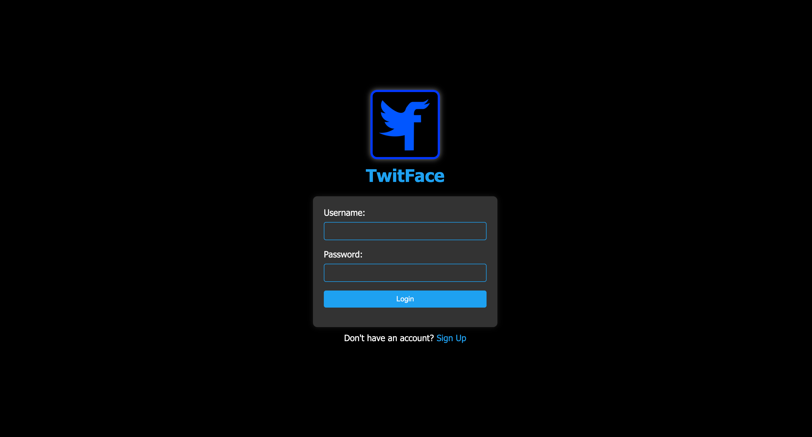
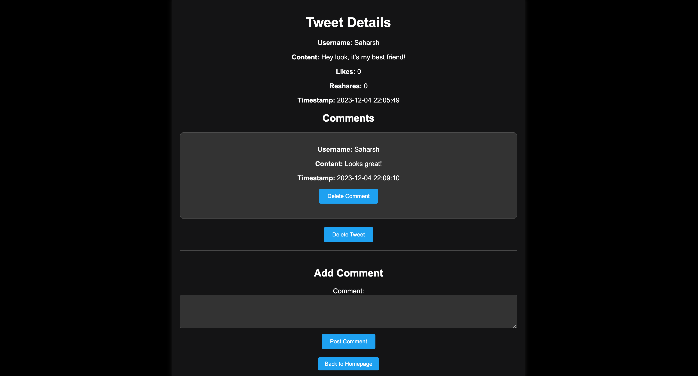

# Twitface User Manual

# Setup
### Cloning the Repository
1. Create a folder in an easily accessible location. Name it whatever you like.
2. Open your terminal
3. Change directories until you are inside the folder you have just created. Recall cd {directory}
4. Once inside of the folder, run the following command:

`git clone https://github.com/saharshgoenka/CSE412-SocialMediaSite.git`

5. Confirm that the cloning was successfully ran by executing the following command:

`ls`
- You should see the name 'CSE412-SocialMediaSite'

### Downloading Dependencies
1. Enter 'CSE412-SocialMediaSite' by running:

`cd CSE412-SocialMediaSite
3. Once inside, run the following command:


# Walkthrough and Navigation

Once the setup is complete, the user can run the application by going into the flask folder and typing ```python3 app.py```. The user can then navigate to ```127.0.0.1:5000``` on any browser where they can start interacting with the application.


## Login Page


Entering a valid username and password combo will allow access to the homepage.


## Sign Up Page


User can insert username, password, email, display name, profile picture(that ends with png, jpg, jpeg) and birthday using the interface. Clicking sign up will create a user with the entered fields.

## Home Page


The homepage features a series of introductory messages, followed by a "Create Tweet" box. Upon entering tweet content and clicking "Tweet," a tweet is generated. The tweet content may consist of text alone or a combination of text and an image, which can be inserted using the "Choose Image" option. Below the tweet creation box, the database displays all tweets. Each tweet is structured with the username as a blue hyperlink leading to the profile page, and "View Comments" as a blue hyperlink leading to the comments page. Additionally, each tweet includes a count, allowing users to increase or decrease it by pressing the like or dislike buttons. The reshare button enables users to reshare or unshare a tweet with a single click. The content of each tweet is displayed prominently in the middle, and if an image is attached, it is included in the content. At the very bottom are two hyperlinks "Settings" and "Logout". Clicking logout will lead to the user getting logged out. Thus, the user will be kicked from the home page back to login page. Clicking the settings hyperlink will lead to a settings page.

## Profile Page

Clicking on the username hyperlink on the homepage redirects users to the profile page. The profile page is structured with user details followed by the tweets of the specific user. Additionally, a follow/unfollow button is prominently displayed. If the user was previously following this profile, it will indicate "following"; otherwise, the button will display "follow." By clicking the follow button, the user becomes a follower of the displayed profile, and the button transforms into "following." To unfollow, users simply click the button again, reverting it back to "Follow."

## Comments Page

Clicking "View Comments" on the homepage directs users to the comments page. This page displays the tweet from the homepage that led to it, along with all comments on that tweet. Each comment includes a username, content, timestamp of when it was posted and a delete comment button. Pressing delete comment will allow the user to delete a comment if the user owns it. If the user does not won the comment that button will not be shown. Below the comments, a text box allows users to enter comment content and post it by clicking "Post Comment". Lastly, there is a delete tweet button at the very button. If the user owns the tweet then pressing delete tweet will delete the tweet and all comments associated with it.

## Settings Page

The settings page allows the useer to edit password, email and display_name. Pressing "Save Changes" will save these changes. There is also a "Delete Account" button. Pressing that will lead to entire usr deletion, all data related to the usr will be purged.
